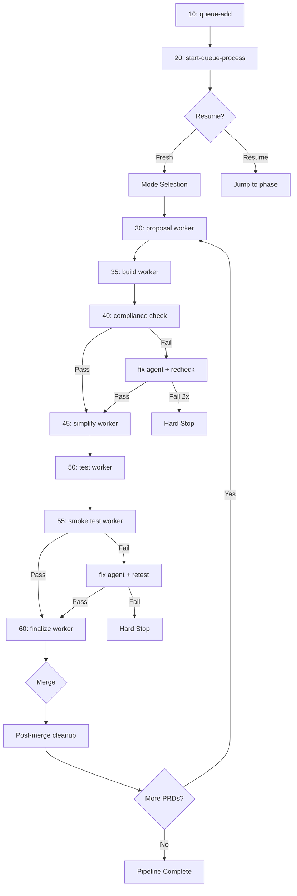

# PRD Orchestration — Agent Team Architecture

## Overview

The orchestration system processes PRDs through a multi-phase pipeline: proposal, build, compliance, simplify, test, smoke, finalize. A **persistent team lead** (`20-start-queue-process`) manages the entire lifecycle by spawning **foreground worker agents** for each phase via the `Task` tool.

### Why This Architecture

- **Persistent lead** — maintains full context, handles all checkpoints and state transitions
- **Fresh workers** — each phase gets clean context, avoids accumulated noise
- **No command chaining** — workers return structured results, the lead decides what's next
- **Resume-safe** — Ruby YAML state survives agent crashes; restarting the lead resumes from the last phase

---

## Flow



---

## Commands

| Command | Type | Purpose |
|---------|------|---------|
| `/otl:orch:10-queue-add` | User | Add PRDs to the processing queue |
| `/otl:orch:20-start-queue-process` | User | Start the orchestration lead |
| `/otl:orch:30-proposal` | Worker | PREPARE → PROPOSAL → PREBUILD (creates OpenSpec change) |
| `/otl:orch:35-build` | Worker | BUILD (implements tasks from completed proposal) |
| `/otl:orch:40-compliance` | Worker | PRD compliance check with Ralph loop (2x retry) |
| `/otl:orch:45-simplify` | Worker | Code quality pass via /simplify (post-build) |
| `/otl:orch:50-test` | Worker | Run tests with Ralph loop (2x retry) |
| `/otl:orch:60-finalize` | Worker | Validate → Archive → Commit → PR |
| `/otl:orch:91-notify` | Utility | Manual Slack notifications |
| `/otl:orch:92-queue-status` | Utility | Display queue and state |

**User commands** are invoked directly. **Worker commands** are spawned by the lead via `Task` tool — you don't invoke them manually.

---

## Quick Start

### Single PRD

```
/otl:orch:10-queue-add docs/prds/persona/my-feature-prd.md
/otl:orch:20-start-queue-process
```

Select "Default Mode" when prompted. The lead will walk through each phase with checkpoints.

### Batch (multiple PRDs)

```
/otl:orch:10-queue-add docs/prds/persona/prd-1.md,docs/prds/persona/prd-2.md,docs/prds/persona/prd-3.md
/otl:orch:20-start-queue-process
```

Select "Default Mode" for reviewed processing, or "Bulk Mode" for unattended batch processing.

### Bulk Mode

Bulk mode auto-approves review checkpoints (proposal review, human review after tests) and sends Slack notifications instead. It still stops for critical errors (gaps/conflicts, spec compliance failure).

---

## Checkpoint Reference

All checkpoints are handled by the lead. Workers never interact with the user.

| Checkpoint | When | Default Mode | Bulk Mode |
|-----------|------|--------------|-----------|
| Mode selection | Start | Ask user | Ask user |
| Clarification needed | Proposal gaps/conflicts | STOP (always) | STOP (always) |
| Proposal review | After proposal created | Ask user | Auto-approve + Slack |
| Human review | After tests pass | Ask user | Auto-approve + Slack |
| Test failure review | Ralph loop exhausted | Ask user | Auto-skip + Slack |
| Compliance failure | Validation failed 2x | STOP (always) | STOP (always) |
| Merge | PR created | Ask user | Auto-squash merge |

---

## State & Recovery

State is persisted in `orch/working/state.yaml` by the Ruby backend. If the lead dies mid-pipeline:

1. Run `/otl:orch:20-start-queue-process` again
2. The lead detects the active phase and queue state
3. It resumes from the correct phase — no work is lost

### Phase → Resume mapping

| State phase | Resumes from |
|---|---|
| `prepare`, `proposal`, `prebuild` | Proposal worker (step 6b) |
| `proposal_complete`, `build` | Build worker (step 6b2) |
| `build_complete`, `compliance` | Compliance worker (Ralph loop, 2x) |
| `compliance_complete`, `simplify` | Simplify worker |
| `simplify_complete`, `test` | Test worker |
| `test_complete`, `validate`, `finalize` | Finalize worker |
| `validate_complete`, `finalize_complete` | Post-merge cleanup |

---

## Responsibility Matrix

| Operation | Who | When |
|-----------|-----|------|
| Phase state transitions | Lead | After each worker completes |
| Queue start/complete/fail | Lead | Start/end of each PRD |
| Mode selection | Lead | Pipeline start |
| Checkpoint interaction | Lead | At each checkpoint |
| Slack notifications | Lead | On checkpoints and errors |
| Usage tracking increments | Worker | During phase execution |
| Test result recording | Worker | After test runs |
| Compliance recording | Worker | After validation |
| Git operations (merge, checkout) | Lead | Post-merge cleanup |

---

## Ruby CLI Quick Reference

```bash
# Queue management
ruby orch/orchestrator.rb queue add --prd-path "path"
ruby orch/orchestrator.rb queue next
ruby orch/orchestrator.rb queue start --prd-path "path"
ruby orch/orchestrator.rb queue complete --prd-path "path"
ruby orch/orchestrator.rb queue fail --prd-path "path" --reason "why"
ruby orch/orchestrator.rb queue status
ruby orch/orchestrator.rb queue list
ruby orch/orchestrator.rb queue archive

# State management
ruby orch/orchestrator.rb state show
ruby orch/orchestrator.rb state set --key phase --value proposal_complete
ruby orch/orchestrator.rb state reset
ruby orch/orchestrator.rb state delete

# Phase commands
ruby orch/orchestrator.rb prepare --prd-path "path"
ruby orch/orchestrator.rb proposal
ruby orch/orchestrator.rb prebuild
ruby orch/orchestrator.rb build
ruby orch/orchestrator.rb test
ruby orch/orchestrator.rb validate

# Usage tracking
ruby orch/orchestrator.rb usage start --prd-path "path"
ruby orch/orchestrator.rb usage increment --phase [phase_name]
ruby orch/orchestrator.rb usage complete --format table
ruby orch/orchestrator.rb usage delete

# Notifications
ruby orch/notifier.rb decision_needed --change-name "X" --message "Y" --checkpoint "Z" --action "W"
ruby orch/notifier.rb error --change-name "X" --message "Y" --phase "Z" --resolution "W"
ruby orch/notifier.rb complete --change-name "X" --message "Y"

# Status
ruby orch/orchestrator.rb status

# PRD validation
ruby orch/prd_validator.rb status --prd-path "path"
ruby orch/prd_validator.rb metadata --prd-path "path"
```

---

## Migration from v1

The v1 command-chaining system is preserved in `archive/` for reference. Key changes:

| v1 | v2 |
|----|-----|
| Commands chain via `Skill` tool | Lead spawns workers via `Task` tool |
| Each command self-initializes from state | Lead injects context into worker prompt |
| Checkpoints handled by individual commands | All checkpoints handled by lead |
| 12 command files (30→35→40→45→50→60) | 9 files (lead + 5 workers + 3 utilities) |
| `91-checkpoint.md` handles checkpoint routing | Absorbed into lead |
| `50-finalize.md` + `60-post-merge.md` separate | Combined into `60-finalize.md` worker + lead post-merge |
| `45-validate-build.md` separate | Absorbed into `60-finalize.md` |
